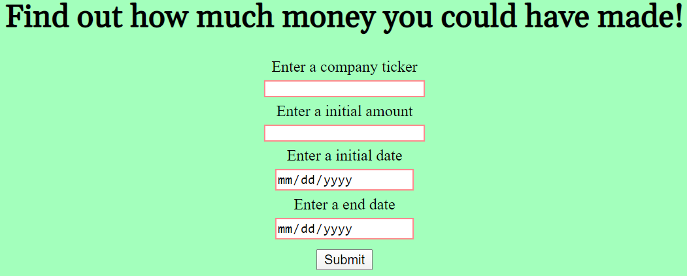

## Title
Finance App
## Link to live app
https://michael-tq.github.io/finance-app/
## Screenshot
{:height=25% width=45%}
## Summary
This app enables a user to compare the stock price of company over time. Specifically it allows the user to select a initial balance, start 
date and end date afterwards, it will calculate the value of that balance at the time of the end date. 
## Technology used
This app used HTML, CSS, Javascript, jQuery.
